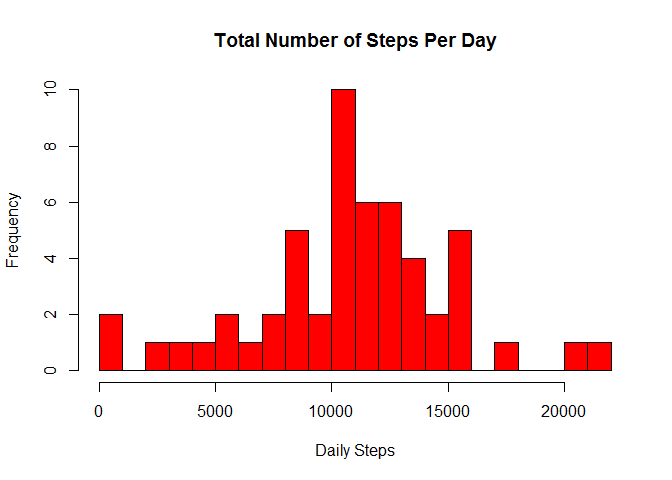
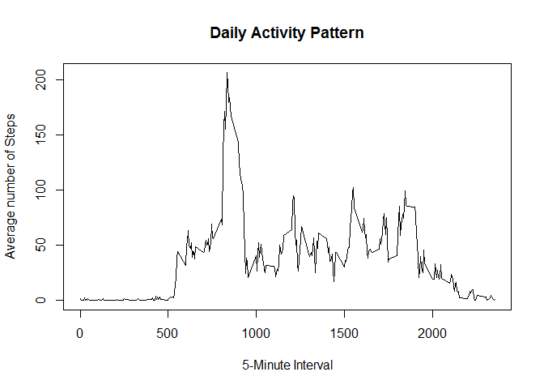
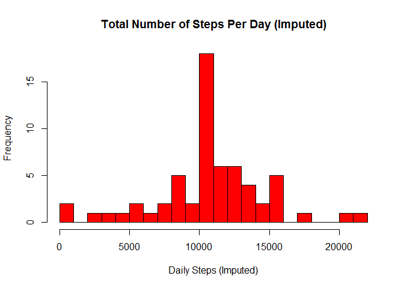
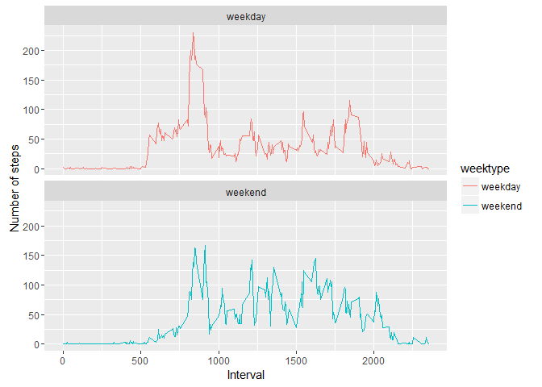

# Reproducible Research: Peer Assessment 1


## Loading and preprocessing the data

Load the data (i.e. read.csv())

```r
if(!file.exists("activity.csv")){
  unzip("activity.zip")
}
data <- read.csv("activity.csv")
```

Process/transform the data (if necessary) into a format suitable for your analysis
Solution: Processing/transforming the Date field

```r
data$date <- as.Date(data$date)
```


## What is mean total number of steps taken per day?

Calculate the total number of steps taken per day

```r
tidy_data <- data[!is.na(data$steps),]
daily_steps <- tapply(tidy_data$steps, tidy_data$date, sum)
```

Make a histogram of the total number of steps taken each day

```r
hist (daily_steps, 20, col="red", main = "Total Number of Steps Per Day", xlab = "Daily Steps")
```



Calculate and report the mean and median of the total number of steps taken per day

```r
mean_daily_steps <- mean(daily_steps)
mean_daily_steps
```

```
## [1] 10766.19
```

```r
median_daily_steps <- median(daily_steps)
median_daily_steps
```

```
## [1] 10765
```


## What is the average daily activity pattern?

Make a time series plot (i.e. type = "l") of the 5-minute interval (x-axis) and the average number of steps taken, averaged across all days (y-axis)

```r
avg_data <- tapply(tidy_data$steps, tidy_data$interval, mean)

plot(y = avg_data, x = names(avg_data), type = "l", 
     main = "Daily Activity Pattern", 
     xlab = "5-Minute Interval", 
     ylab = "Average number of Steps")
```



Which 5-minute interval, on average across all the days in the dataset, contains the maximum number of steps?

```r
max_steps_5minint <- names(avg_data[avg_data==max(avg_data)]) 
max_steps_5minint
```

```
## [1] "835"
```

## Imputing missing values

Calculate and report the total number of missing values in the dataset (i.e. the total number of rows with NAs)

```r
missing_values <- length(which(is.na(data$steps)))
```

Devise a strategy for filling in all of the missing values in the dataset.
Create a new dataset that is equal to the original dataset but with the missing data filled in.

Solution: Missing values will be filled with the mean of 5 minute interval

```r
imputed_data <- data
imputed_data[which(is.na(imputed_data$steps)),1] <- avg_data[as.character(imputed_data[which(is.na(imputed_data$steps)),3])]
```

Make a histogram of the total number of steps taken each day and Calculate and report the mean and median total number of steps taken per day.  

```r
imputed_daily_steps <- tapply(imputed_data$steps, imputed_data$date, sum)

hist (imputed_daily_steps, 20, col="red", main = "Total Number of Steps Per Day (Imputed)", xlab = "Daily Steps (Imputed)")
```



Do these values differ from the estimates from the first part of the assignment? What is the impact of imputing missing data on the estimates of the total daily number of steps?
Solution: Mean value remained intact to 10766.19 whereas there is slight increase in the Median i.e. before it was 10765 and after it is 10766.19
From impact point of view, with the imputed data i.e. after filling in missing values, Median got slightly increased. 

```r
mean_imputed_daily_steps <- mean(imputed_daily_steps)
mean_daily_steps
```

```
## [1] 10766.19
```

```r
mean_imputed_daily_steps
```

```
## [1] 10766.19
```

```r
median_imputed_daily_steps <- median(imputed_daily_steps)
median_daily_steps
```

```
## [1] 10765
```

```r
median_imputed_daily_steps
```

```
## [1] 10766.19
```

## Are there differences in activity patterns between weekdays and weekends?

Create a new factor variable in the dataset with two levels - "weekday" and "weekend" indicating whether a given date is a weekday or weekend day.

```r
imputed_data <- cbind(imputed_data, "weekday" = weekdays(imputed_data$date))
imputed_data <- cbind(imputed_data, "weektype" = ifelse(imputed_data$weekday == "Saturday" | imputed_data$weekday == "Sunday", "weekend", "weekday"))
```

Make a panel plot containing a time series plot (i.e. type = "l") of the 5-minute interval (x-axis) and the average number of steps taken, averaged across all weekday days or weekend days (y-axis). See the README file in the GitHub repository to see an example of what this plot should look like using simulated data.


```r
library(dplyr)
```

```
## 
## Attaching package: 'dplyr'
```

```
## The following objects are masked from 'package:stats':
## 
##     filter, lag
```

```
## The following objects are masked from 'package:base':
## 
##     intersect, setdiff, setequal, union
```

```r
library(ggplot2)

avg_data_final <- imputed_data %>%
  group_by(interval, weektype) %>%
  summarise(steps = mean(steps))

g <- ggplot(avg_data_final, aes(x=interval, y=steps, col = weektype)) + 
  geom_line() + 
  facet_wrap(~weektype, ncol = 1, nrow=2)+
  xlab("Interval") + 
  ylab("Number of steps")

print (g)
```



