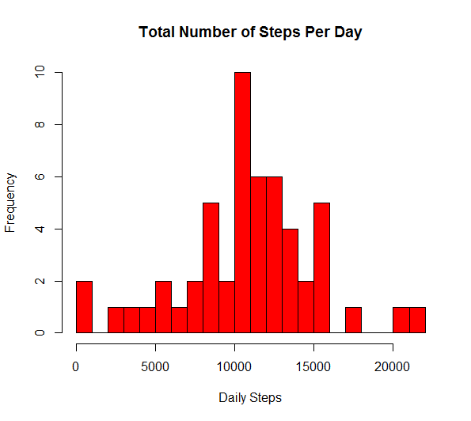
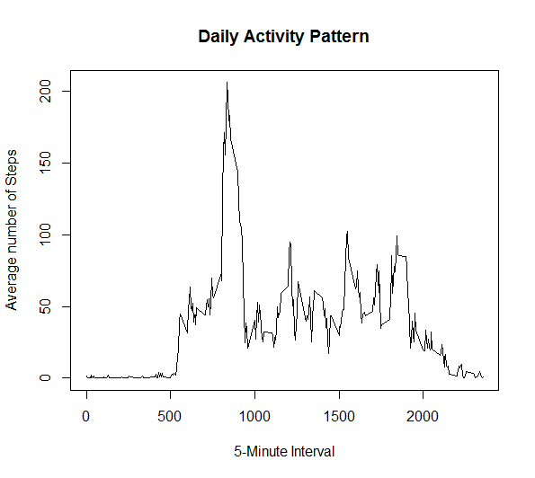
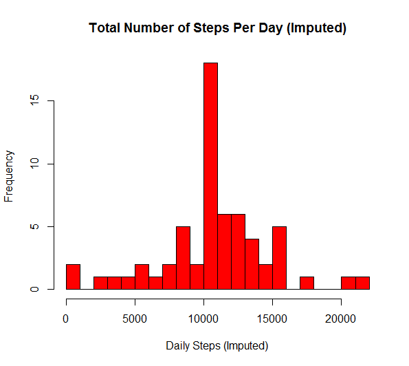
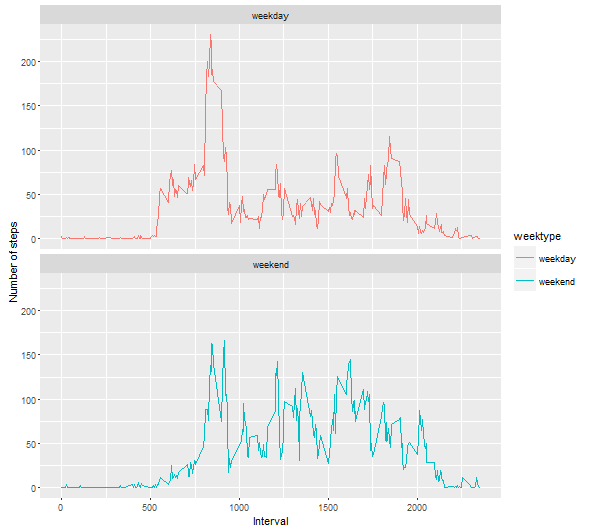

## Loading and preprocessing the data

Load the data (i.e. read.csv())

```r
if(!file.exists("activity.csv")){
  unzip("activity.zip")
}
data <- read.csv("activity.csv")
```

Process/transform the data (if necessary) into a format suitable for your analysis

Solution: Processing/transforming the Date field

```r
str(data)
```

```
## 'data.frame':	17568 obs. of  3 variables:
##  $ steps   : int  NA NA NA NA NA NA NA NA NA NA ...
##  $ date    : Factor w/ 61 levels "2012-10-01","2012-10-02",..: 1 1 1 1 1 1 1 1 1 1 ...
##  $ interval: int  0 5 10 15 20 25 30 35 40 45 ...
```

```r
data$date <- as.Date(data$date)
str(data)
```

```
## 'data.frame':	17568 obs. of  3 variables:
##  $ steps   : int  NA NA NA NA NA NA NA NA NA NA ...
##  $ date    : Date, format: "2012-10-01" "2012-10-01" ...
##  $ interval: int  0 5 10 15 20 25 30 35 40 45 ...
```


## What is mean total number of steps taken per day?

Calculate the total number of steps taken per day

```r
tidy_data <- data[!is.na(data$steps),]
daily_steps <- tapply(tidy_data$steps, tidy_data$date, sum)
daily_steps
```

```
## 2012-10-02 2012-10-03 2012-10-04 2012-10-05 2012-10-06 2012-10-07 
##        126      11352      12116      13294      15420      11015 
## 2012-10-09 2012-10-10 2012-10-11 2012-10-12 2012-10-13 2012-10-14 
##      12811       9900      10304      17382      12426      15098 
## 2012-10-15 2012-10-16 2012-10-17 2012-10-18 2012-10-19 2012-10-20 
##      10139      15084      13452      10056      11829      10395 
## 2012-10-21 2012-10-22 2012-10-23 2012-10-24 2012-10-25 2012-10-26 
##       8821      13460       8918       8355       2492       6778 
## 2012-10-27 2012-10-28 2012-10-29 2012-10-30 2012-10-31 2012-11-02 
##      10119      11458       5018       9819      15414      10600 
## 2012-11-03 2012-11-05 2012-11-06 2012-11-07 2012-11-08 2012-11-11 
##      10571      10439       8334      12883       3219      12608 
## 2012-11-12 2012-11-13 2012-11-15 2012-11-16 2012-11-17 2012-11-18 
##      10765       7336         41       5441      14339      15110 
## 2012-11-19 2012-11-20 2012-11-21 2012-11-22 2012-11-23 2012-11-24 
##       8841       4472      12787      20427      21194      14478 
## 2012-11-25 2012-11-26 2012-11-27 2012-11-28 2012-11-29 
##      11834      11162      13646      10183       7047
```

Make a histogram of the total number of steps taken each day

```r
hist (daily_steps, 20, col="red", main = "Total Number of Steps Per Day", xlab = "Daily Steps")
```



Calculate and report the mean and median of the total number of steps taken per day

```r
mean_daily_steps <- mean(daily_steps)
mean_daily_steps
```

```
## [1] 10766.19
```

```r
median_daily_steps <- median(daily_steps)
median_daily_steps
```

```
## [1] 10765
```


## What is the average daily activity pattern?

Make a time series plot (i.e. type = "l") of the 5-minute interval (x-axis) and the average number of steps taken, averaged across all days (y-axis)

```r
avg_data <- tapply(tidy_data$steps, tidy_data$interval, mean)

plot(y = avg_data, x = names(avg_data), type = "l", 
     main = "Daily Activity Pattern", 
     xlab = "5-Minute Interval", 
     ylab = "Average number of Steps")
```



Which 5-minute interval, on average across all the days in the dataset, contains the maximum number of steps?

```r
max_steps_5minint <- names(avg_data[avg_data==max(avg_data)]) 
max_steps_5minint
```

```
## [1] "835"
```

## Imputing missing values

Calculate and report the total number of missing values in the dataset (i.e. the total number of rows with NAs)

```r
missing_values <- length(which(is.na(data$steps)))
missing_values
```

```
## [1] 2304
```

Devise a strategy for filling in all of the missing values in the dataset.
Create a new dataset that is equal to the original dataset but with the missing data filled in.

Solution: Missing values will be filled with the mean of 5 minute interval

```r
imputed_data <- data
imputed_data[which(is.na(imputed_data$steps)),1] <- avg_data[as.character(imputed_data[which(is.na(imputed_data$steps)),3])]
```
Assuring that there is no more missing values

```r
length(which(is.na(imputed_data$steps)))
```

```
## [1] 0
```
Make a histogram of the total number of steps taken each day and Calculate and report the mean and median total number of steps taken per day.  

```r
imputed_daily_steps <- tapply(imputed_data$steps, imputed_data$date, sum)

hist (imputed_daily_steps, 20, col="red", main = "Total Number of Steps Per Day (Imputed)", xlab = "Daily Steps (Imputed)")
```



Do these values differ from the estimates from the first part of the assignment? What is the impact of imputing missing data on the estimates of the total daily number of steps?

Solution: Mean value remained intact to 10766.19 whereas there is slight increase in the Median i.e. before it was 10765 and after it is 10766.19
From impact point of view, with the imputed data i.e. after filling in missing values, Median got slightly increased. 

```r
mean_imputed_daily_steps <- mean(imputed_daily_steps)
mean_daily_steps
```

```
## [1] 10766.19
```

```r
mean_imputed_daily_steps
```

```
## [1] 10766.19
```

```r
median_imputed_daily_steps <- median(imputed_daily_steps)
median_daily_steps
```

```
## [1] 10765
```

```r
median_imputed_daily_steps
```

```
## [1] 10766.19
```

## Are there differences in activity patterns between weekdays and weekends?

Create a new factor variable in the dataset with two levels - "weekday" and "weekend" indicating whether a given date is a weekday or weekend day.

```r
imputed_data <- cbind(imputed_data, "weekday" = weekdays(imputed_data$date))
imputed_data <- cbind(imputed_data, "weektype" = ifelse(imputed_data$weekday == "Saturday" | imputed_data$weekday == "Sunday", "weekend", "weekday"))
```

Make a panel plot containing a time series plot (i.e. type = "l") of the 5-minute interval (x-axis) and the average number of steps taken, averaged across all weekday days or weekend days (y-axis). See the README file in the GitHub repository to see an example of what this plot should look like using simulated data.


```r
library(dplyr)
```

```
## 
## Attaching package: 'dplyr'
```

```
## The following objects are masked from 'package:stats':
## 
##     filter, lag
```

```
## The following objects are masked from 'package:base':
## 
##     intersect, setdiff, setequal, union
```

```r
library(ggplot2)

avg_data_final <- imputed_data %>%
  group_by(interval, weektype) %>%
  summarise(steps = mean(steps))

g <- ggplot(avg_data_final, aes(x=interval, y=steps, col = weektype)) + 
  geom_line() + 
  facet_wrap(~weektype, ncol = 1, nrow=2)+
  xlab("Interval") + 
  ylab("Number of steps")

print (g)
```



